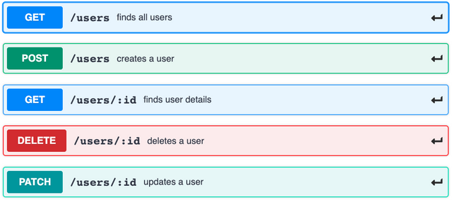

# Dockerizing a RESTful API for Managing Person Objects

This is an example of how to Dockerize a simple RESTful API for managing person objects using Node.js and Express.js.

## Prerequisites

Before you can Dockerize this API, you need to have the following software installed on your local machine:

- Docker

## Getting Started

To get started, follow these steps:

1. Pull this repository to your local machine:

       >> docker pull abdelrahman0122/project

2. Run the Docker container:

        >> docker run -p 5000:5000 abdelrahman0122/project

This will start the API in a Docker container on `http://localhost:5000`.

## API Specification
The RESTful API have the following endpoints:
   - GET /persons:  Retrieve a list of all person objects.
   - POST /persons:  Create a new person object
   - GET /persons/{id}:  Retrieve a specific person object by its ID
   - PATCH/persons/{id}:  Update a specific person object by its ID
   - DELETE /persons/{id}:  Delete a specific person object by its ID.

## Conclusion

Dockerizing a simple RESTful API for managing person objects using Node.js and Express.js is a straightforward process.

